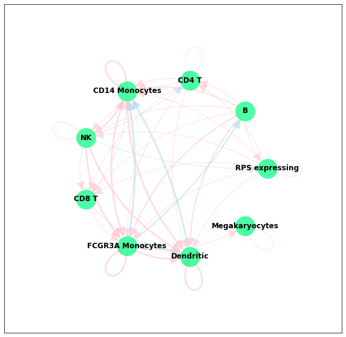
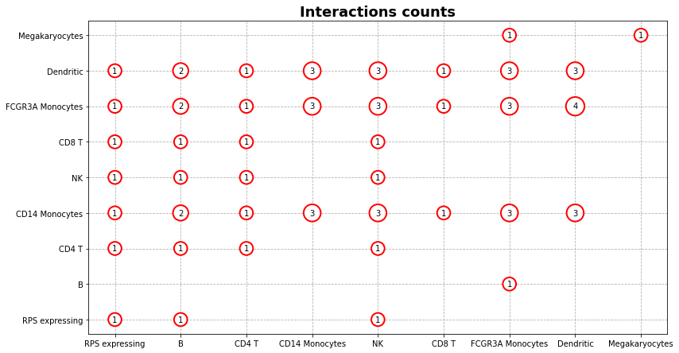
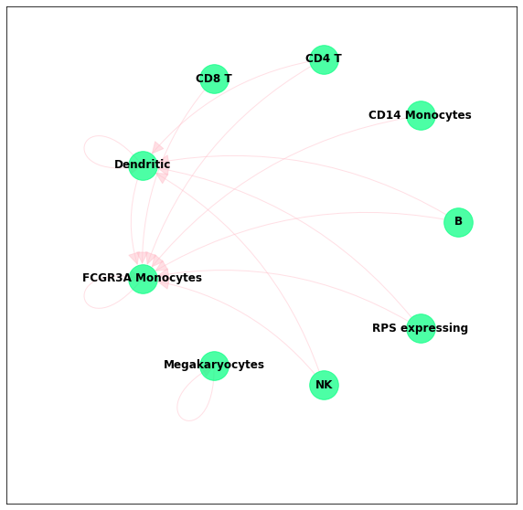
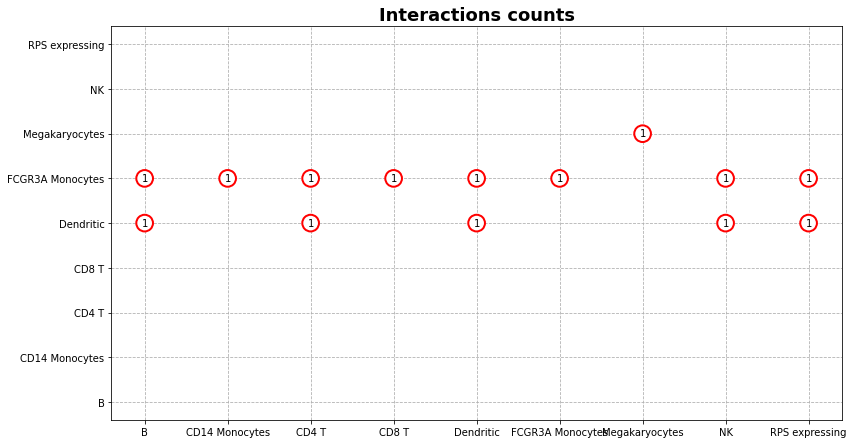

# communiquer
A simple interface for the tools that predict cells communication from Single-Cell RNA sequencing data

# Installation for the development
1. Clone the repository
```console
$ git clone https://github.com/VladimirShitov/communiquer.git
```

2. Install [poetry](https://python-poetry.org/). Recommended way:
```console
$ curl -sSL https://raw.githubusercontent.com/python-poetry/poetry/master/get-poetry.py | python -
```
Alternative way (not recommended):
```console
$ pip install --user poetry
```

3. Install project's python dependencies:
```console
$ poetry install
```

4. Install tools for inferring cells communications. Follow the instructions from the repositories:
* [Cellchat](https://github.com/sqjin/CellChat)
* [CellPhoneDB](https://github.com/Teichlab/cellphonedb)
* [CellCall](https://github.com/ShellyCoder/cellcall) (not yet supported)

Make sure that `cellphonedb` is added to the PATH (i. e. you can run it via command line from any directory)

5. Run the code!

# Examples

### Preparation

Import packages:

```python
from pathlib import Path

from communiquer.launchers import CellChatLauncher, CellPhoneDBLauncher
from communiquer.drawing import draw_chord_diagram
```

Provide paths to the data. You have to prepare 2 files:
1. **Normalized counts matrix**. Rows are genes, columns are barcodes (or other cells IDs
2. **Meta information about cells**. It must have 2 columns: the first one with cell IDs (e.g. barcodes), and the second with cells labels (e.g. cell types)

Example of the meta file:
|Cell             | cell_type      |
|-----------------|:---------------|
| AAACATACAACCAC-1 | RPS expressing |
| AAACATTGAGCTAC-1 | B              |
| AAACATTGATCAGC-1 | CD4 T          |
| AAACCGTGCTTCCG-1 | CD14 Monocytes |
| AAACCGTGTATGCG-1 | NK             |
...

### Running CellPhoneDB

```python
cpdb_launcher = CellPhoneDBLauncher(
    meta_file_path=meta_path,
    counts_file_path=counts_path,
    output_path=cpdb_output_path,  # CellPhoneDB saves its output to the files
    project_name="pbmc3k",
    counts_data="gene_name"  # If you have Ensemble IDs, leave default
)
cpdb_launcher.run()
cpdb_launcher.read_output(convert_to_cellchat_format=True)
```

Then you can display the output by checking:
```python
cpdb_launcher.pvalues_df
cpdb_launcher.means_df
```
To see outputs of this code, check [example notebook](example.ipynb)

Count significant interactions and build a chord diagram with them: 
```python
cpdb_launcher.count_significant_interactions() # This sets cpdb_launcher.counts_df
cpdb_launcher.visualise_interactions()
```



Or a dot plot:



### Running CellChat 

```python
cellchat_launcher = CellChatLauncher(counts_file_path=counts_path, meta_file_path=meta_path)
cellchat_launcher.run()
cellchat_launcher.read_output()
```

You can then view the output:
```python
cellchat_launcher.weights_df
cellchat_launcher.pvalues_dfs
cellchat_launcher.probabilities_dfs
```

Cellchat stores every interaction in a different matrix. You can access these interactions by name:
```python
cellchat_launcher.pvalues_dfs["ESAM_ESAM"]
```

Check the outputs in the [example notebook](example.ipynb)

You can run visualisations with the same interface:

```python
cellchat_launcher.visualise_interactions()
```



```python
cellchat_launcher.dotplot_counts()
```


